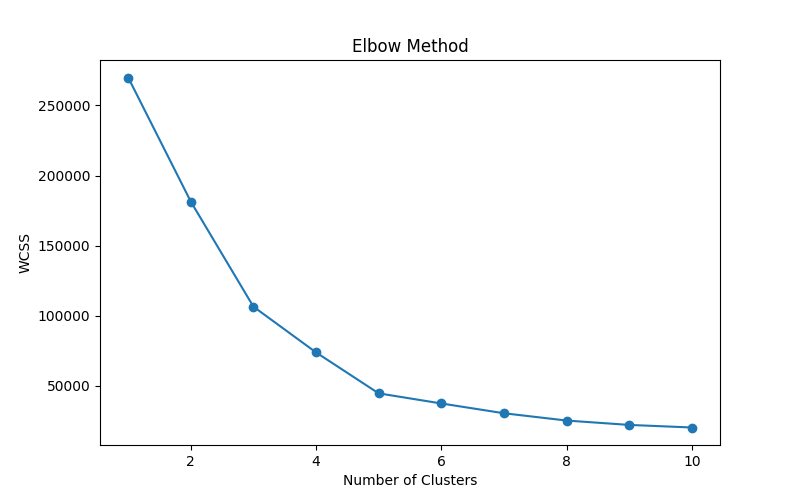
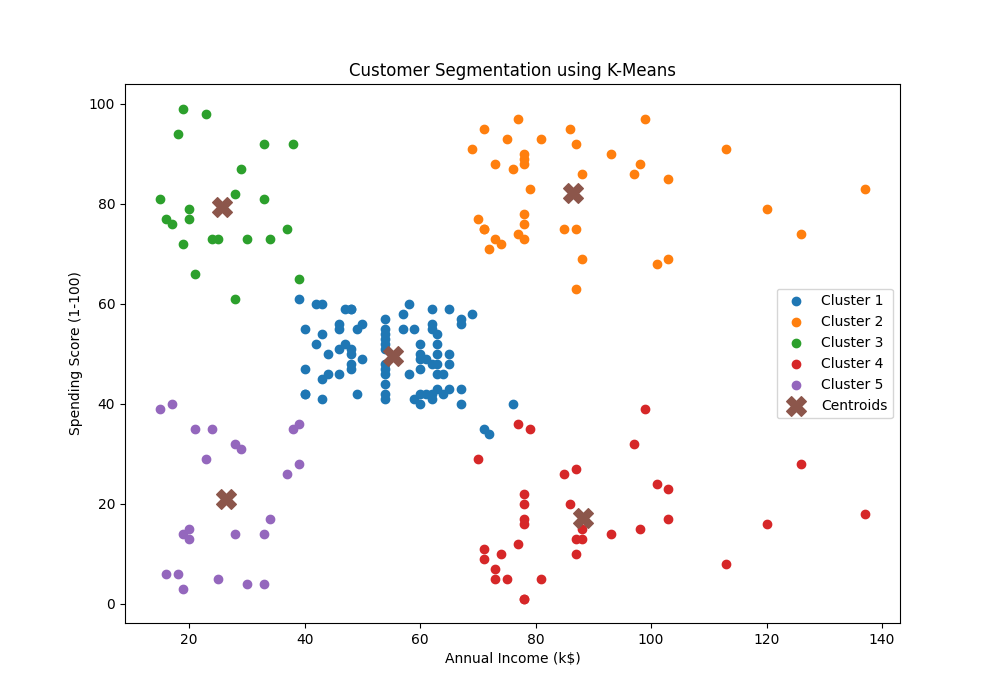

# Customer Segmentation using K-Means Clustering

## Overview

This project was completed as part of the Machine Learning Internship at Prodigy InfoTech.

The objective is to segment retail store customers into different groups based on their Annual Income and Spending Score using K-Means Clustering.

## Dataset

Mall Customers Dataset

Features Used:
- Annual Income (k$)
- Spending Score (1-100)

## Technologies Used

- Python
- Pandas
- Matplotlib
- Scikit-learn

## Methodology

1. Data Loading
2. Data Exploration
3. Elbow Method for Optimal K
4. K-Means Clustering
5. Customer Segmentation Visualization
6. Cluster Analysis

## Results

Optimal Number of Clusters: 5

Customer Distribution:

| Cluster | Customers |
|----------|----------|
| 0 | 81 |
| 1 | 39 |
| 2 | 22 |
| 3 | 35 |
| 4 | 23 |

## Generated Files

- elbow_method.png
- customer_segments.png
- customer_segments.csv

## Elbow Method

## Customer Segmentation Result

## Internship

Prodigy InfoTech

Task 02 - Customer Segmentation using K-Means Clustering
